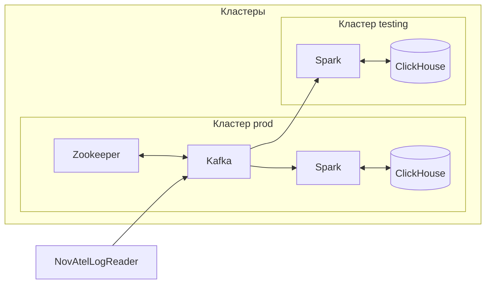

# Непрерывная интеграция

На базе Kafka можно реализовать ветвление исходных данных и реализовать две
ветки кластера: нестабильную, в которой будет вестись разработка (во всеми
вытекающими последствиями), и стабильную, которая будет прерываться только для
обновления к проверенным версиям. И, таким образом, получить что-то на подобие
CI/CD.

## Реализация с единым брокером Kafka

Например, можно реализовать 2 кластера: _prod_ и _testing_.

В кластере _prod_ будет работать основная шина Kafka, т.к. он будет реже
перезапускаться и поэтому будет более стабильным. Кластер _testing_ подключается
к Kafka из кластера _prod_:



Кластер _prod_ нужно запускать штатным образом с использованием штатных
настроек:

```sh
docker-compose --profile default up -d
```

Из кластера _testing_ нужно запустить только вычислительную
часть. Предварительно необходимо переопределить адрес шины, на которую
подключается `spark-streamer-1`, на адрес шины из другого кластера в
`.env`-файле Docker Compose:

```
KAFKA_HOST=<адрес_шины_в_другом_кластере>
```

Затем, после запуска Kafka в первом кластере, можно запустить кластер _testing_:

```sh
docker-compose --profile base up -d
```
